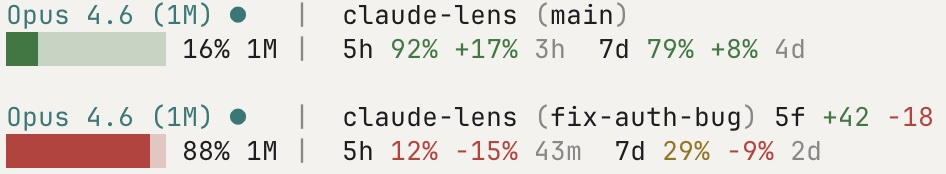

# Claude Lens

Are you burning through your Claude Code quota too fast? Or do you have more headroom than you think?

Other statuslines show how much you *used*. Claude Lens shows whether your *pace* is sustainable.



## What It Shows

```
[Opus 4.6 ●] ~/project | main 3f +42 -7
██████░░░░ 57% of 1M | 5h: 62% +23% | 7d: 74% | 1h52m
```

**Line 1** -- Model, effort, project directory, git branch + uncommitted diff stats

**Line 2** -- Context window, quota remaining, pace, session duration

The key number is the pace indicator after remaining %:

- `+23%` green = you've used 23% less than expected at this point in the window. Headroom. Keep going.
- `-15%` red = you're 15% ahead of a linear burn. Slow down or you'll hit the wall.
- No indicator = you're within 10% of expected pace. On track.

Remaining quota is color-coded: green (>30% left), yellow (11-30%), red (<=10%).

## Install

```bash
curl -o ~/.claude/statusline.sh \
  https://raw.githubusercontent.com/Astro-Han/claude-lens/main/claude-lens.sh

claude config set statusLine.command ~/.claude/statusline.sh
```

Restart Claude Code. That's it. Only dependency is `jq`.

To remove: `claude config set statusLine.command ""`

## Under the Hood

158 lines of Bash. Claude Code polls the statusline every ~300ms, so speed matters:

| Data | Source | Cache |
|------|--------|-------|
| Model, context, duration, cost | stdin JSON (single `jq` call) | None needed |
| Git branch + diff | `git` commands | `/tmp`, 5s TTL |
| Quota (5h, 7d, extra usage) | Anthropic Usage API | `/tmp`, 300s TTL, async background refresh |

Usage API calls happen in a background subshell -- the statusline never blocks waiting for the network.

## License

MIT
